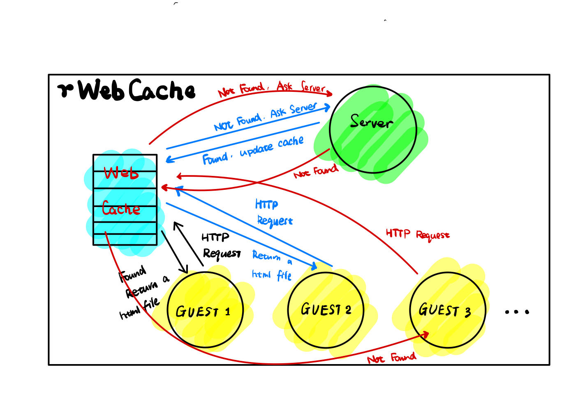

# rWebCache

A simple Web Cache written from scratch in rust.




## Reach me

Ask me freely if you have any advice : <lovenvibest@gmail.com>


## Progress

* [x] Build basic project frame
* [x] Implement main function
* [x] Distinguish tcpconnect
* [x] Complete modules
* [ ] Add Threadpool
* [ ] Add documention
* [ ] Add test

## Brief introduction

Recently, this project is not complete.

## Doc

Thanks to `cargo`, to see the documention of this project, use the following command

```shell
cargo doc --open
```

## Basic Logic

The logic of this project is simple right now. Here is the procedure:

1. Open Web Server and Web Cache
2. Create `N` clients
   > this means create N threads
3. Randomly, let clients send `http` request
   - Check if status line = `"GET / HTTP/1.1"`  ( Web Cache )
   - Search the content in Web Cache
     - if exists, write back and return true
   - Send request to Web Server
   - Search the content in Web Server
     - if exists, update Web Cache and write back to client from Web Cache, return true
     - return false
4. Close all the clients
5. Close Web Server and Web Cache

Only support to status line equals to `GET / HTTP/1.1` right now.